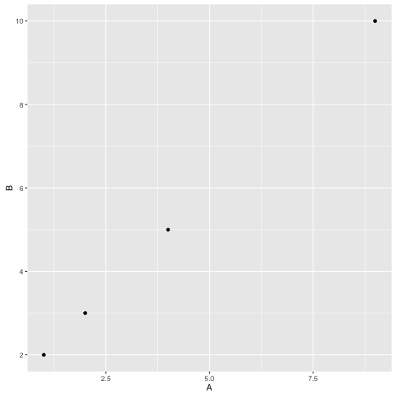

The Grammar of Graphics
========================================================
author: Albert Y. Kim
date: Monday 2016/2/22


What is a statistical graphic?
========================================================

At its simplest: A statistical graphic is a mapping of variables in a

* **`data`** set to 
* **`aes()`**thetic attributies of 
* **`geom_`**etric objects.

These are, in my view, the most important components to think about.


Example: Napolean's March on Moscow
========================================================
Famous graphical illustration by Minard of Napolean's march to and retreat from Moscow in 1812


Example: Napolean's March on Moscow
========================================================

6 dimensions (variables) of information on a 2 dimensional page:

**`data`** | **`aes()`**  | **`geom_`**
------------- | ------------- | -------------
longitude | **`x`** | **`point`** 
latitude | **`y`** | **`point`** 
army size | **`size`** | **`path`**
forward vs retreat | **`color`** | **`path`**
date | **`x, y`** | **`text`**
temperature | **`x, y`** | **`line`**


Example from Paper
========================================================

```r
simple <- 
  data.frame(
    A = c(2,1,4,9),
    B = c(3,2,5,10),
    C = c(4,1,15,80),
    D = c("a", "a", "b", "b")
  )
```


Example from Paper
========================================================

```r
ggplot(data=simple, aes(x=A, y=B)) + geom_point()
```




Benefits
========================================================

Quotes from paper:

* "**Iteratively** update a plot." i.e. build it in a modular (piece-by-piece) fashion instead of in one immutable (unchangeable) piece
* "Giving us a **framework** to think about graphics, and hopefully shortening the distance from mind to paper."
* "Encourages the use of graphics **customized** to a particular problem rather than relying on generic named graphics." Ex: terms like "scatterplot", "histogram", "coxcomb" plot

Note the key words: **iterative**, **framework**, and **customized**.


Limitations
========================================================

* Steep learning curve, just like learning a new grammar
* It teaches you grammar, but not how to write poetry. i.e. it sets up
a framework for making graphics, but it doesn't teach you how to make **good graphics**.
* "Beyond that, it seems difficult to see how to do much more algorithmically, and we need to turn to education and training."
* "all plots are static and separate." i.e. **non-interactive**.


Limitations
========================================================

Packages for interactive graphics include
  + `ggvis`: in development by Wickham
  + `plotly`: from the creators of [http://www.plot.ly](http://www.plot.ly)
  + `shiny`: later in the course. Install the `shiny` package -> File -> New
  File -> Shiny Web App... -> Single File -> Click on "Rup App"

and many, many more...


