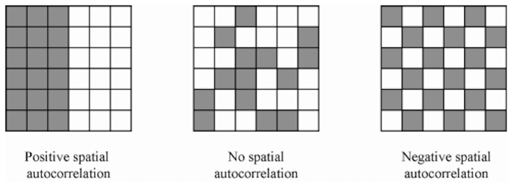
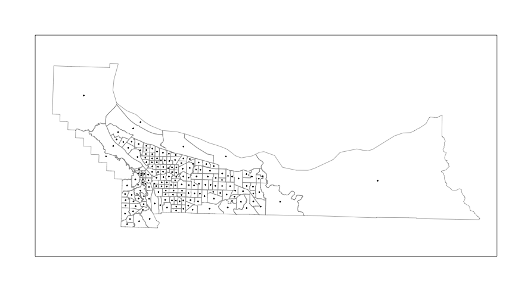
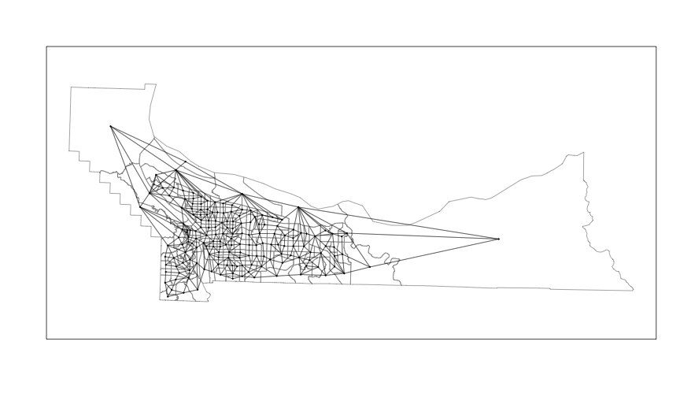

Spatial Autocorrelation
========================================================
author: Albert Y. Kim
date: Monday April 11, 2016


First Law of Geography
========================================================

Geographer and statistician Waldo Tobler (1970) summarized a key component
affecting any analysis of spatially referenced data through his **first law of
geography**:

_Everything is related to everything else, but near things are more related than
far things._


Spatial Autocorrelation
========================================================

This succinctly defines the statistical notion of **(positive) spatial
autocorrelation**, in which pairs of observations taken nearby are more alike
than those taken farther apart.  i.e. they are correlated.

Such data violate the **independence assumption** that many standard statistical
methods hinge on and therefore spatial autocorrelation must be accounted for.


Spatial Autocorrelation
========================================================



Map of Multnomah County in Oregon
========================================================

Consider a map of the 171 regions (i.e. census tracts) in Multnomah County in
Oregon.  For each region we mark its **geographic centroid**

* i.e. its 2-dimensional mean
* i.e. the point at which if you held it by a needle underneath, the region would balance


Map of Multnomah County
========================================================




Map of Multnomah County
========================================================

There are:

* 882 total links i.e. pairs of regions that share a border
* Distribution of the number of links. Ex:
    + There are 11 regions that have 3 neighbors.
    + There are 2 regions that have 11 neighbors.


```

 3  4  5  6  7  8  9 10 11 
11 45 62 31 12  6  1  1  2 
```


Spatial Connectivity
========================================================




Spatial Autocorrelation
========================================================

A **global index of spatial autocorrelation** provides a summary over the entire
study area of the level of spatial similarity observed among neighboring
observations.


Spatial Autocorrelation
========================================================

Say we have $n$ regions each with a measurement of some variable of interest
$Y_i$ for $i=1, \ldots, n$

Today we'll investigate $Y_i$ = proportion of the $n=171$ census tract's
population that are hispanic.


Global Indices of Spatial Autocorrelation
========================================================

Let

* $w_{ij}$ be a weight describing the proximity of regions $i$ and $j$
* $\mbox{sim}_{ij}$ be a measure of similarity between $Y_i$ and $Y_j$

Most global indices are of the form:

$$
\frac{\sum_{i=1}^{n}\sum_{j=1}^{n}w_{ij} \mbox{sim}_{ij}}{\sum_{i=1}^{n}\sum_{j=1}^{n}w_{ij}}
$$

i.e. it's a weighted average of the similarity of the variable over all pairs of regions.


Moran's I
========================================================
Moran's $I$ statistic (1950) is among the most used measures

$$
\frac{1}{s^2}\frac{\sum_{i=1}^{n}\sum_{j=1}^{n}w_{ij} (Y_i - \overline{Y})(Y_j - \overline{Y})}{\sum_{i=1}^{n}\sum_{j=1}^{n}w_{ij}}
$$
where
$$
s^2 = \frac{1}{N} \sum_{i=1}^{N} (Y_i - \overline{Y})^2
$$

This is used as hypothesis test statistic.


Properties of Moran's I
========================================================

* If neighboring regions tend to
    + have similar values (pattern is clustered): $I$ will be positive
    + have different values (pattern is regular): $I$ will be negative
* Under the null hypothesis of no spatial correlation, the expected value of $I$ is $$-\frac{1}{N-1}$$
* Unlike a traditional correlation coefficient, $I$ is not restricted to be between $[-1,1]$
* A $p$-value is computed.


Today's Example
========================================================

You're going to evaluate Moran's $I$ assuming proximity weights

$$
w_{ij} = \left\{
\begin{array}{cl}
1 & \mbox{if regions $i$ and $j$ share a border}\\
& \mbox{(not including corners)}\\
0 & \mbox{otherwise}
\end{array}
\right.
$$

to see if Hispanic populations in Mulnomah County tend to **cluster** i.e.
exhibit positive spatial autocorreleation.
